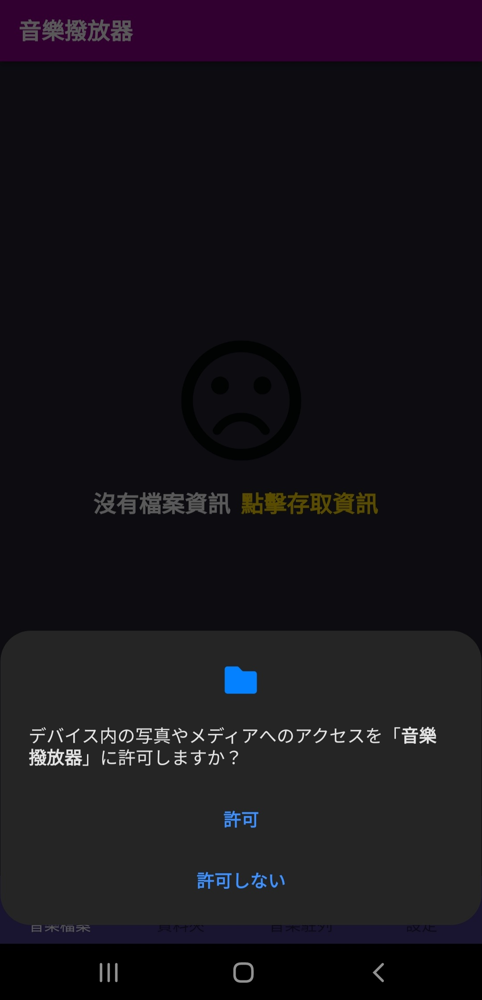
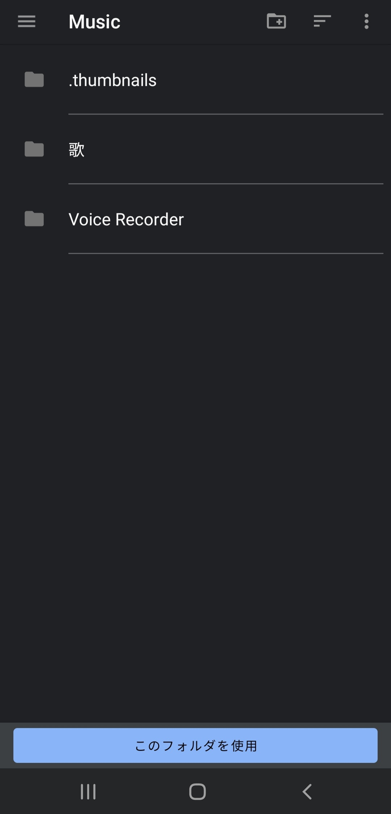
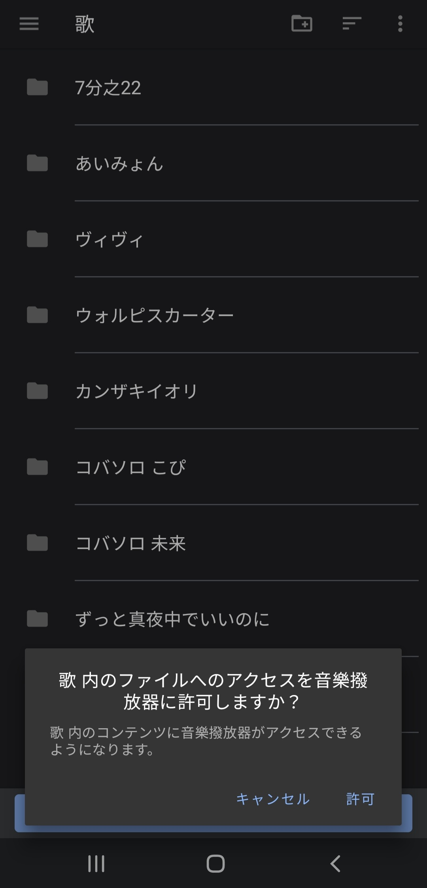
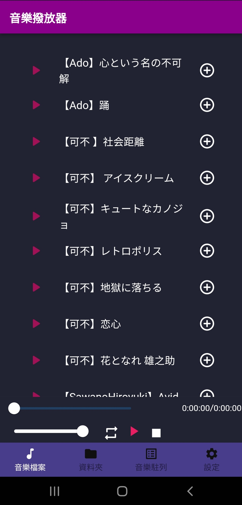
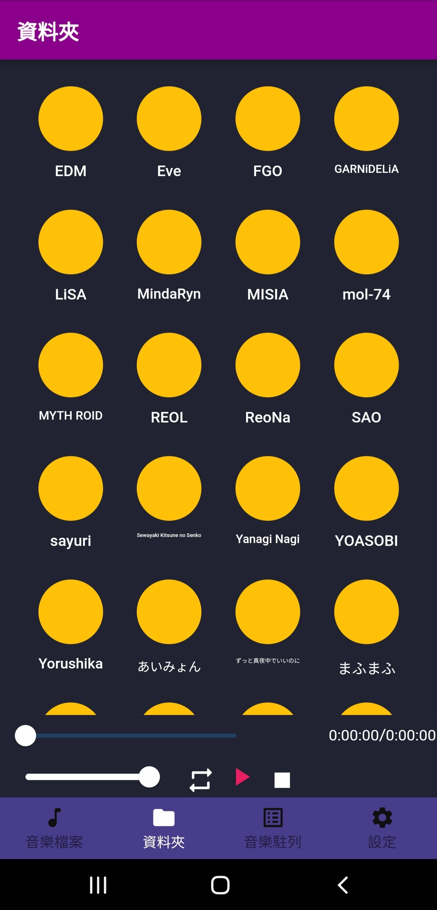
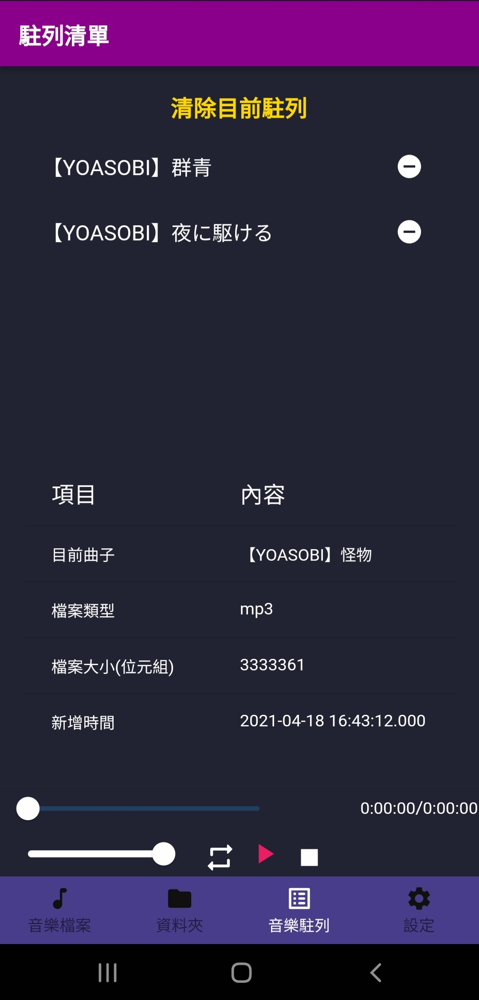
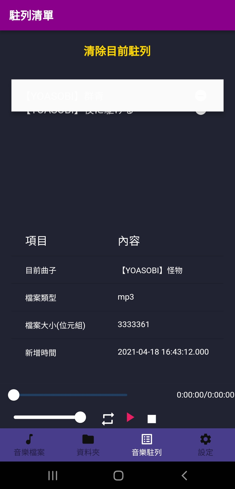
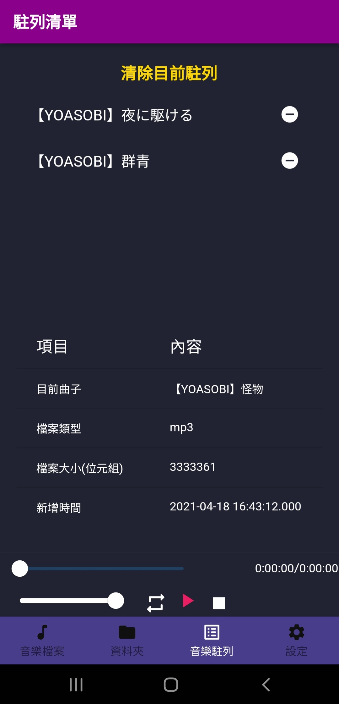
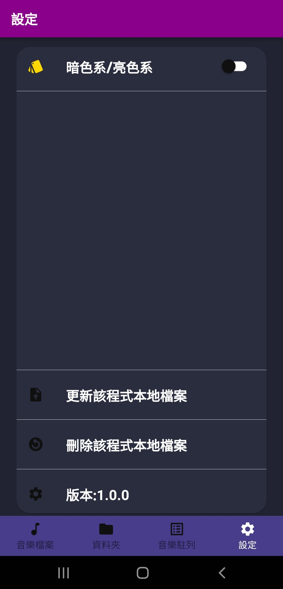
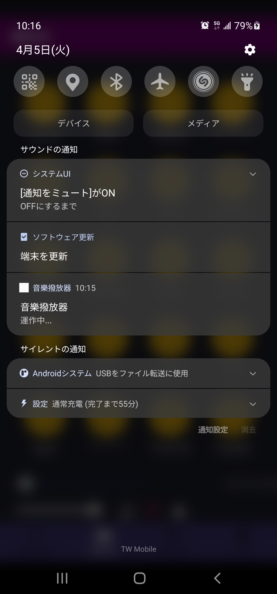

## 該應用程式皆使用Flutter官方物件，而參考套件為[**audioplayers**](https://pub.dev/packages/audioplayers),[**file_picker**](https://pub.dev/packages/file_picker),[**shared_preferences**](https://pub.dev/packages/shared_preferences)與[**path_provider**](https://pub.dev/packages/path_provider)，以上。

 

## 該程式目前為音樂撥放器，支援背景撥放，內無廣告，以及目前不採用資料夾遊走，欲使用請依照以下步驟操作。

### 進入應用程式，點擊點擊取得資訊

### 點擊許可

  

## 找到音樂存在的地方，因為本應用程式不採資料遊走，而是採固定框架寫法，所以音樂檔案的前一處必須有一個資料夾作為歸類，而所有的歸類資料夾又會放在一個大資料夾，我們需要的就是存取該大資料夾，以我們這裡為例我們的大資料夾(歌)是放在Music資料夾內，我們就會點選歌後，點選下方的使用這個資料夾。

### 歌(大資料夾)=>Ado(歸類資料夾)=>【Ado】踊.mp3(音樂檔案)

  

## 點選大資料夾後，會再次詢問是否讓音樂撥放器使用【大資料夾名稱】，請點擊許可。

## 大功告成!!! 之後進來應用程式就不用再使用重複操作，不過之後如果有加入新歌到手機裡面，要到這個應用程式的設定更新，之後可能會釋出自動更新的版本，請大家拭目以待(有時間的話啦QQ)。

## 在音樂檔案這裡我們會看到我們音樂名稱以及左邊的撥放按鈕和右邊的新增安紐，請大家要直接撥放音樂的話點選左邊的撥放鍵，如果大家覺得這樣操作比較不舒服，想要直接點選音樂名稱撥放，也可以向我反映。

## 而點選撥放鍵則會讓整個大資料夾的音樂進入駐列排隊。

  

## 左邊新增的部分可以將歌曲新增至音樂駐列中，如果今天想聽的撥放清單新增完畢後，點選下方控制區中的撥放按鈕即可。

  

 

# 控制區介紹

## 控制區我們會看見 兩個滑桿，第一條比較長的是音樂撥放時的進度條，而這個進度條是可以互動的，如果想跳播，拉動進度條即可。
## 而第二條滑桿則是音樂撥放器內部的音樂大小聲調整，這個可以用在假如有語音聊天又想聽音樂，可是音樂太大聲的時候，可以調整的，互動方式與進度條雷同。

## 而右側的0:00:00/0:00:00 則是目前撥放歌曲的 進度時間/完整時間。

## 下方的三個按鈕，第一個按鈕為調整單曲撥放或是循環撥放，循環撥放的話，以恩月駐列的資料為主。

## 第二個按鈕就是撥放與暫停，而第三個按鈕就是停止，而暫停和停止的不同在於，暫停是停在目前播的位置，而停止則是讓音樂回到原點並且暫停。

# 資料夾

## 接下來就是介紹資料夾的部分在這裡是以剛剛的資料夾分類當作每一個按鍵，而按鍵點選之後進去 操作就跟在音樂檔案中的操作一樣，唯一不同的點是，點選直接撥放，音樂駐列中只會有該資料夾的音樂，意思就是點選直接撥放，駐列中就會有這個專輯^^

# 音樂駐列
## 在這裡上方會先看到 清除目前駐列，點選後整個駐列就會清除，而第一首(正在播的音樂)播完後就會停止撥放。
## 中間則會顯示 2~N個音樂駐列右方按鈕則是將該音樂清出駐列，而對某一首音樂常壓則是可以讓他延後撥放或是提前撥放。
## 下方則是顯示目前撥放的歌或是排在第一位的歌曲的詳細內容。

## 這樣子就完成交換了!

# 設定

## 設定區目前可以設定程式色系以及對這個應用程式的儲存檔案做修改與刪除。

## 更新該程式本地檔案的意思就是在手機中會有這個應用程式的儲存資料，還記得前面有將檔案匯入進來的操作吧?那個操作就是把音樂的位置都存進這個應用程式的支援目錄，而他比較像是快取的存在，在程式開啟之後只會讀取那一個檔案，而假如我們下載其他歌到手機內，沒有做這個更新的動作，他就只會讀原本寫好的檔案。

## 刪除該程式本地檔案的意思就是刪除這個應用程式的檔案，不會影響到手機內的其他檔案，就像是刪除這個應用程式的快取而已。

## 最後因為我們的程式支援背景撥放，所以在音樂撥放時，通知欄內會有我們應用程式的常駐通知，點擊該通知就可以回到應用程式，而在音樂撥放器沒有音樂撥放時，則不會出現，應用程式也不會背景運作。

## 最後的最後希望使用這個應用程式的人，能夠開心地享受自己喜歡的音樂!